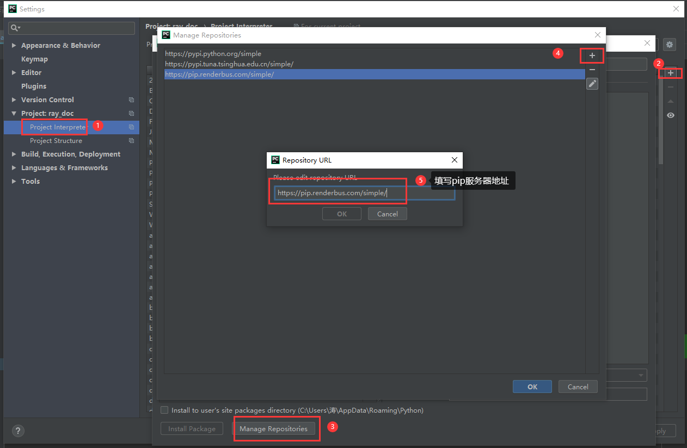
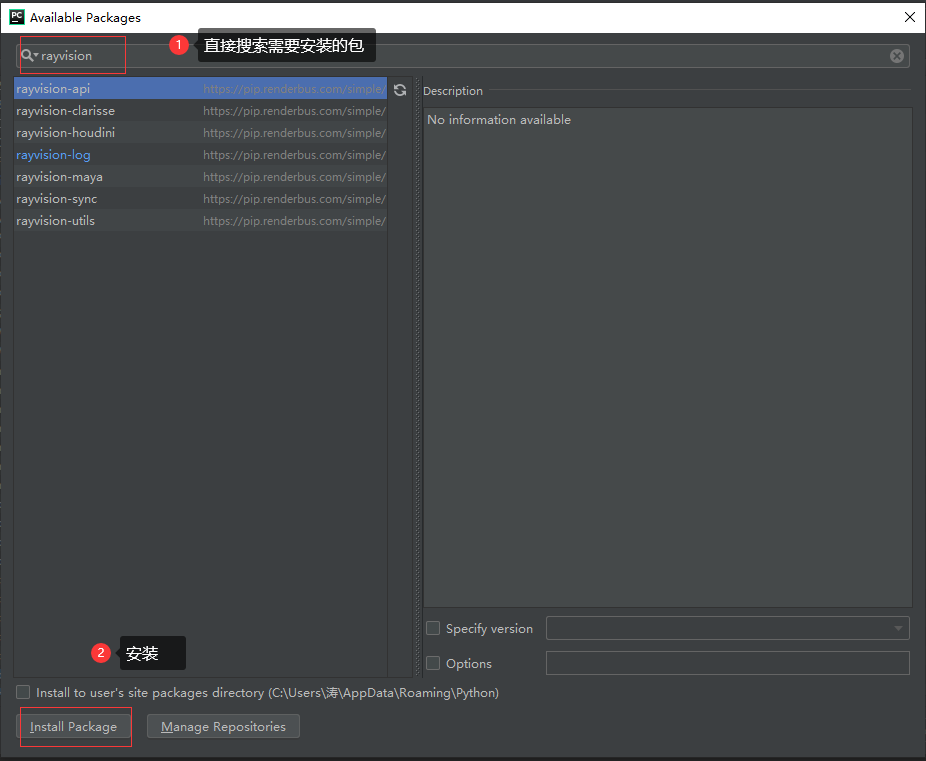

.. warning::
   使用前请确保本地Python环境和PIP可用。

安装指南
=========

以安装rayvision_api包为样例

**方法一:**
   - 直接从GitHub下载源码:

   ``git clone git@gitlab.renderbus.com:internal/rayvision_api.git``

**方法二:**
   - 渲染的模块都保存在 `PIP服务器 <https://pip.renderbus.com/simple/>`_ ,使用以下命令直接安装:

   ``pip install rayvision_api -i https://pip.renderbus.com/simple/``

**方法三:**
   - 在IDE中配置PIP源以下地址: ``https://pip.renderbus.com/simple/``
   - 以pycharm为例::

